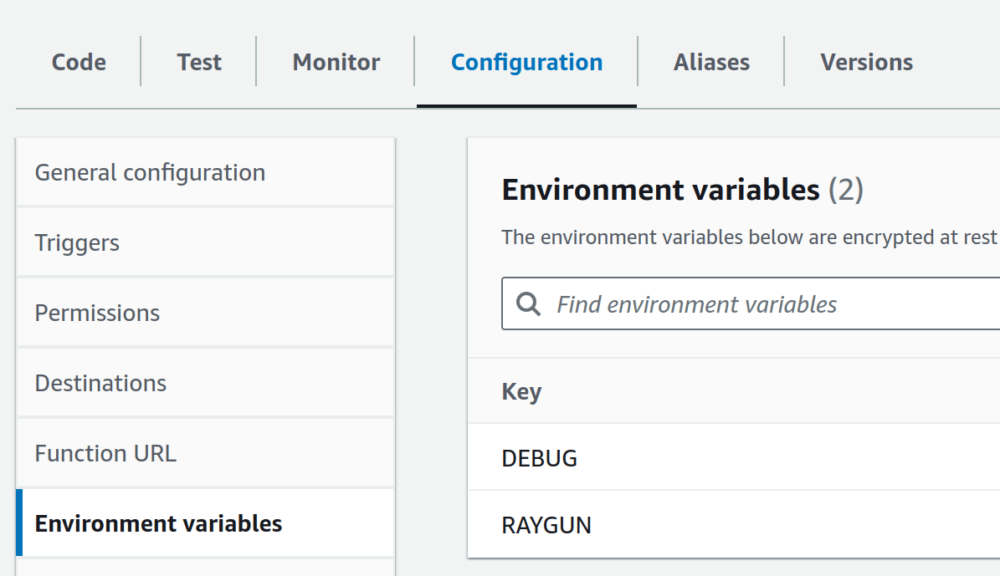

# Raygun + AWS Lambda Example

This is a sample AWS Lambda function to show how to use Raygun4Node and AWS Lambda together.

This example uses `@raygun/aws-lambda` from local path:

```json
"dependencies": {
  "@raygun.io/aws-lambda": "file:../"
}
```

Installing the `raygun` dependency is not necessary, as `@raygun.io/aws-lambda` already depends on `raygun` package.

## Prepare package

Run the `prepare.sh` script.

This script installs the dependencies, builds the example, and packages it in the `example.zip` file.

We recommend running the script from a terminal, to check that everything runs as expected.
You need the `zip` command-line tool installed in order to run this script.

Otherwise, follow the [AWS Lambda documentation](https://docs.aws.amazon.com/lambda/latest/dg/nodejs-package.html) to build and deploy the example.

## Deploy

To run this example, you have to create first an AWS Lambda function.

Follow the instructions in AWS' website: https://docs.aws.amazon.com/lambda/latest/dg/getting-started.html

Once your function is ready, use the "Upload from" to upload the generated `example.zip` file.


## Example setup

Before running the example, you have to complete the following setup.

1. Add `RAYGUN` environment variable with your API key.
2. Add `DEBUG` environment variable with the value `raygun` to see detailed logs.



3. Under the `Test` tab, create a new event with the following content:


## Run the sample

Finally, select the newly created event and click the "Test" button.


You should see execution results similar to these:

```
Test Event Name
RaygunError

Response
{
  "errorType": "Error",
  "errorMessage": "It's an AWS error!",
  "trace": [
    "Error: It's an AWS error!",
    "    at /var/task/index.js:10:11",
    "    at /var/task/node_modules/@raygun.io/aws-lambda/build/raygun.aws.js:68:42",
    "    at step (/var/task/node_modules/@raygun.io/aws-lambda/build/raygun.aws.js:33:23)",
    "    at Object.next (/var/task/node_modules/@raygun.io/aws-lambda/build/raygun.aws.js:14:53)",
    "    at /var/task/node_modules/@raygun.io/aws-lambda/build/raygun.aws.js:8:71",
    "    at new Promise (<anonymous>)",
    "    at __awaiter (/var/task/node_modules/@raygun.io/aws-lambda/build/raygun.aws.js:4:12)",
    "    at runHandler (/var/task/node_modules/@raygun.io/aws-lambda/build/raygun.aws.js:59:12)",
    "    at /var/task/node_modules/@raygun.io/aws-lambda/build/raygun.aws.js:123:35",
    "    at step (/var/task/node_modules/@raygun.io/aws-lambda/build/raygun.aws.js:33:23)"
  ]
}

Function Logs
2024-06-18T08:48:13.081Z raygun [raygun.breadcrumbs.ts] initialized successfully
2024-06-18T08:48:13.130Z raygun [raygun.ts] Client initialized
START RequestId: xyz Version: $LATEST
2024-06-18T08:48:13.135Z raygun [raygun.breadcrumbs.ts] enter with new store
2024-06-18T08:48:13.151Z raygun [raygun.breadcrumbs.ts] recorded breadcrumb: [object Object]
2024-06-18T08:48:13.152Z raygun [raygun.breadcrumbs.ts] recorded breadcrumb: [object Object]
2024-06-18T08:48:13.152Z raygun [raygun.breadcrumbs.ts] recorded breadcrumb: [object Object]
2024-06-18T08:48:13.210Z raygun [raygun.messageBuilder.ts] Added breadcrumbs: 3
2024-06-18T08:48:14.024Z	xyz	ERROR	Invoke Error 	{"errorType":"Error","errorMessage":"It's an AWS error!","stack":["Error: It's an AWS error!","    at /var/task/index.js:10:11","    ...
2024-06-18T08:48:14.024Z raygun [raygun.ts] Successfully sent message (duration=813ms)
END RequestId: xyz
REPORT RequestId: xyz	Duration: 917.62 ms	Billed Duration: 918 ms	Memory Size: 128 MB	Max Memory Used: 78 MB	Init Duration: 189.88 ms

Request ID
xyz
```

The sent error should appear on your Raygun Crash Reporting console as well.
